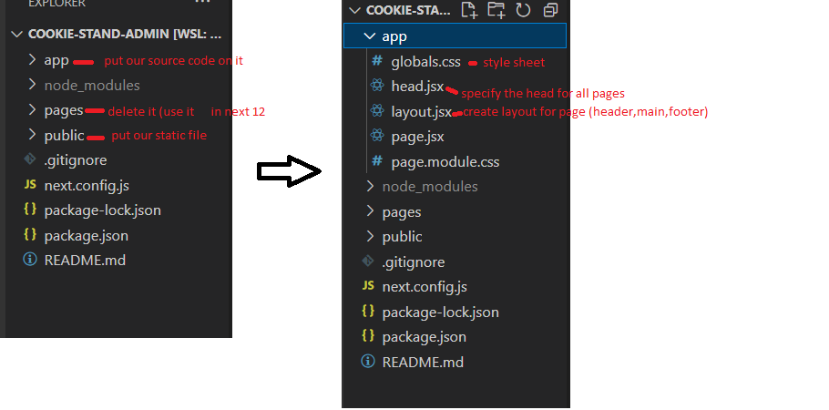

# Next.js-Tailwind-CSS

# Next.js-app [source](https://beta.nextjs.org/docs/installation)

## create a new React application :
1. create adirectory in the terminal 
2. create your next App `npx create-next-app@latest --experimental-app`
3. cd app name 
4. create empty repo without readme file on GitHub
5. Then, in the root of your React App, run the following commands:
6. rm -rf .git
7. git init
8. git add .
9. git commit -m "first commit"
10. git branch -m main
11. git remote add origin https://github.com/userName/repoName.git
12. git push origin main
    

**no need to install router library**

13. code .
    



## Running the Development Server
1. Run `npm run dev` to start the development server.
2. Visit `http://localhost:3000` to view your application.
3. Edit app/layout.js or app/page.js and save to see the updated result in your browser.


## Get started 
1. delete pages directory 
2. **by editing app/page.jsx**  delete every thing after the return and rewrite on it 
   
```
import { Inter } from '@next/font/google'

const inter = Inter({ subsets: ['latin'] })

export default function Home() {
  return (
   <>
   </>
  )
}
```


# Tailwind-CSS [source](https://beta.nextjs.org/docs/styling/tailwind-css)


1. `npm install -D tailwindcss postcss autoprefixer`
2. `npx tailwindcss init -p`
3. cont the requirment in the link above 