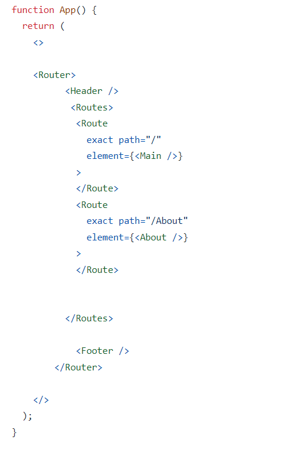
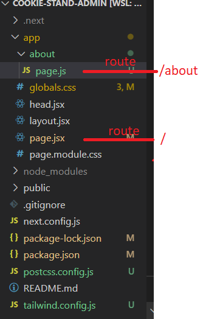

# next JS Components lab 32:

1. **ROUTE**
    * in `React` function need to install route then import it with all component stafe then use it like : 
        
        


    * in `NEXT JS`  :[source](https://beta.nextjs.org/docs/routing/fundamentals)

          
      * go to App directory----- create a directory  "about " inside it put `page.js` and add your code the the route will be `/about`

        


2. **layout.jsx**
```
import './globals.css'
import Footer from './components/Footer'
import Header from './components/Header'

export default function RootLayout({ children }) {
  return (
    <html lang="en">
      {/*
        <head /> will contain the components returned by the nearest parent
        head.jsx. Find out more at https://beta.nextjs.org/docs/api-reference/file-conventions/head
      */}
      <head />
      <body>
        <Header />
        <main>
          {children}
        </main>
        <Footer />
      </body>
    </html>
  )
}
```

3. App directory --- components directory


* `Header.js `
```
       import React from 'react'
import Link from 'next/link'
import Image from 'next/image';


export default function Header(){
    return(
        <header>
            <nav className='flex flex-wrap items-center px-3 bg-cyan-900'>
                <Link className='inline-flex items-center px-2 mr-4' href='/'>
                    <Image 
                    src='/assets/logo3.png'
                    width={90}
                    height={50}
                    alt="Pet logo"
                    >
                    </Image>
                    <span className='text-xl fonr-bold tracking-wide text-white uppercase'>Pets Shop</span>
                </Link>
                <section className='hidden w-full lg:inline-flex lg:flex-grow lg:w-auto'>
                    <section className='flex flex-col items-start w-full lg:inline-flex lg:flex-row lg:ml-auto lg:w-auto lg:items-center lg:h-auto'>
                        <Link className='items-center justify-center w-full px-3 py-2 font-bold- text-white rounded lg:inline-flex lg:w-auto hover:bg-cyan-700 hover:text-white' href='/'>Home</Link>
                        <Link className='items-center justify-center w-full px-3 py-2 font-bold- text-white rounded lg:inline-flex lg:w-auto hover:bg-cyan-700 hover:text-white' href='/'>Services</Link>
                        <Link className='items-center justify-center w-full px-3 py-2 font-bold- text-white rounded lg:inline-flex lg:w-auto hover:bg-cyan-700 hover:text-white' href='/about'>About Us</Link>
                        <Link className='items-center justify-center w-full px-3 py-2 font-bold- text-white rounded lg:inline-flex lg:w-auto hover:bg-cyan-700 hover:text-white' href='/'>Contact Us</Link>
                    </section>
                </section>
            </nav>
        </header>
    )
}

```


* `Footer.js`
```
import React from 'react'

export default function Footer(){
    return(
        <footer className='py-6 text-center'>
            <p className="text-gray-500 font-center light text-mb-3">Copy Right 2022 by 401 class</p>
        </footer>
    )
}

```

4. **add any image in `public` directory inside create a `assets` directory


5. add internal image 

```

import Image from 'next/image';

<Image 
      src="/assets/Logo.png"
      width={100}
      height={50}
      alt="cookie logo"
      >
      </Image>
```

6. remote image 
```
import Image from 'next/image';
<Image
      src="https://s3.amazonaws.com/my-bucket/profile.png"
      alt="Picture of the author"
      width={500}
      height={500}
    />
```
7. link 

```
import Link from 'next/link'
<Link className='items-center justify-center w-full px-3 py-2 font-bold- text-white rounded lg:inline-flex lg:w-auto hover:bg-cyan-700 hover:text-white' href='/'>Home</Link>


```

8. form 

```

```

9. deale with dynamic data 

* go to the parents of the clint components and write this command in the first line ` "use client" `

```
import { useState } from "react";

export default function Form(){

    
    const [userInput, setUserInput] = useState("");

const handleChange = (e) => {
        setUserInput(e.target.value);
        // console.log(e.target.value)
    }

<input onChange={handleChange}  >

```